# 전체 시스템 아키텍처

이 문서는 현재 ndx TypeScript 런타임의 단일 상위 아키텍처 지도다. CLI,
소켓 서버, 인증, 프로젝트 선택, 세션 런타임, 모델 라우팅, 도구 실행,
Docker 샌드박스, 영속 저장소, 대시보드, 배포, 패키지 배포 경계를 한
문서에 모은다.

## 아키텍처 약속

- `ndx`의 일반 시작 인자는 선택적 소켓 서버 주소 하나뿐이다.
  생략하면 `127.0.0.1:45123`을 사용한다.
- ndx 서버는 로컬 호스트 프로세스다. Docker는 서버 본체가 아니다.
- Docker는 shell 계열 capability tool을 실행하기 위한 워크스페이스별
  샌드박스다.
- 서버는 live session, event fan-out, auth, SQLite persistence, project
  listing, Docker sandbox 생성, tool execution을 소유한다.
- CLI는 서버의 클라이언트다. 상태를 표시하거나 UI 상태를 캐시할 수는
  있지만 권위 있는 세션 저장소가 아니다.
- 로그인되지 않은 WebSocket JSON-RPC 연결에서 public `server/info` 외의
  login 필요 method는 서버가 무시한다.
- 서버는 pinned sandbox image에 의존한다. 기본 이미지는
  `hika00/ndx-sandbox:0.1.1`이다.
- sandbox image를 바꾸면 `hika00` Docker Hub 계정에 새 tag로 push하고,
  서버를 그 push된 tag로 검증한 뒤 병합해야 한다.
- 루트 패키지는 `@neurondev/ndx`로 배포된다.

## 전체 시스템

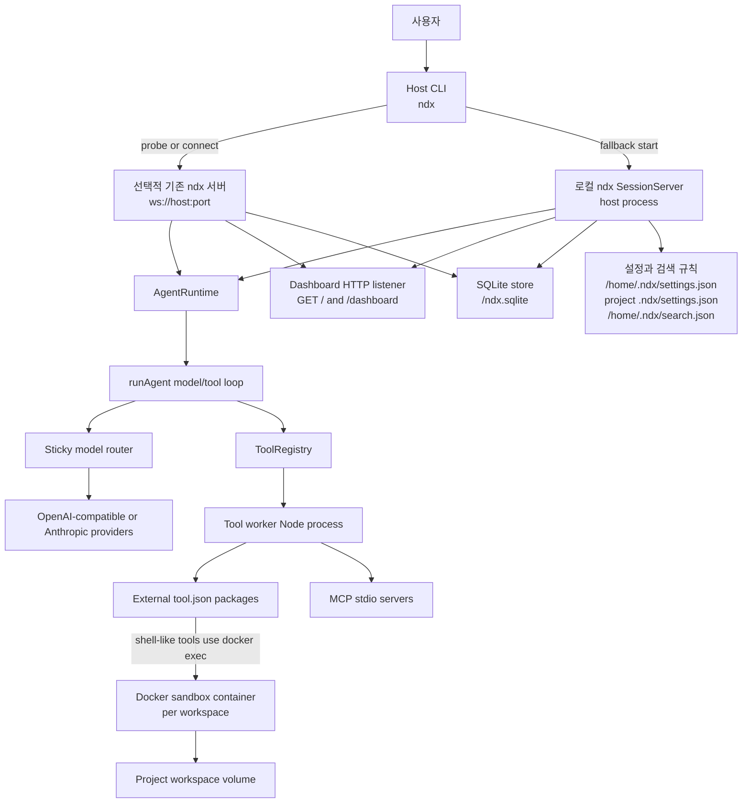

## 소스 소유권

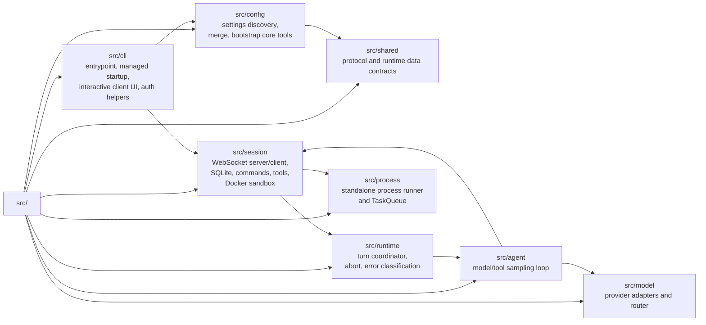

| 영역          | 소유 내용                                                                  |
| ------------- | -------------------------------------------------------------------------- |
| `src/cli`     | CLI 시작, managed startup, 대화형 command UI, auth helper                  |
| `src/config`  | 설정 파일 발견, merge, model/provider 검증, core tool bootstrap            |
| `src/session` | socket server/client, SQLite, slash command, tool registry, Docker sandbox |
| `src/runtime` | turn 조정, abort, runtime event 발행, error classification                 |
| `src/agent`   | model/tool sampling loop                                                   |
| `src/model`   | OpenAI-compatible, Anthropic adapter, sticky router                        |
| `src/process` | ndx 의존성 없는 process runner와 TaskQueue                                 |
| `src/shared`  | protocol과 runtime data contract                                           |

## CLI 시작 절차

일반 `ndx` 시작은 선택적 positional argument 하나만 가진다. `--mock`,
`--connect`, `serve`, `ndxserver`, `NDX_EMBEDDED_SERVER=1`은 호환성과 개발
경로로 남아 있다.

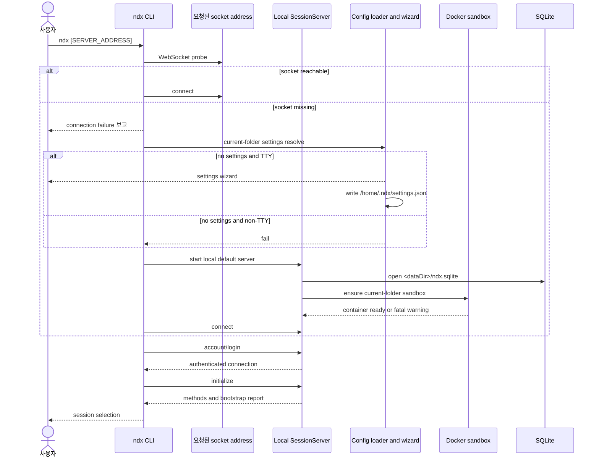

## 첫 실행과 세션 선택

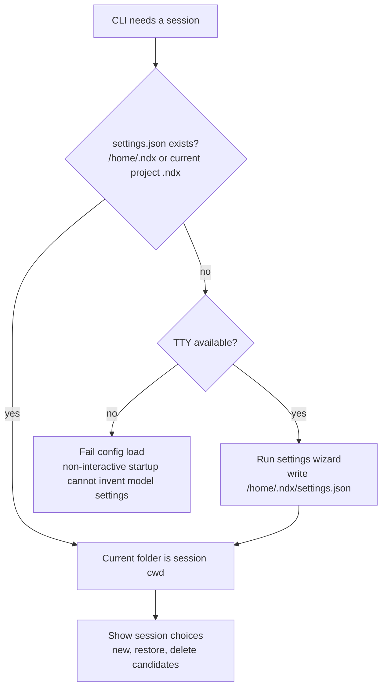

첫 실행 규칙:

| 조건                        | 동작                                                 |
| --------------------------- | ---------------------------------------------------- |
| 서버 주소 연결 성공         | CLI는 기존 서버에 붙고 즉시 로그인한다.              |
| 서버 주소 연결 실패         | 실패를 보고하고 로컬 기본 서버를 기본 주소로 띄운다. |
| settings 파일 없음, TTY     | wizard가 project `.ndx/settings.json`을 만든다.      |
| settings 파일 없음, non-TTY | model/provider를 추측하지 않고 실패한다.             |
| 세션 시작                   | 현재 폴더가 session `cwd`가 된다.                    |

## 소켓 인증 경계

인증된 WebSocket connection user가 권위 있는 사용자다. 이후 request params의
`user` 값은 호환성을 위해 받을 수 있지만, 서버 실행 범위는 인증된 connection
user 기준이다.

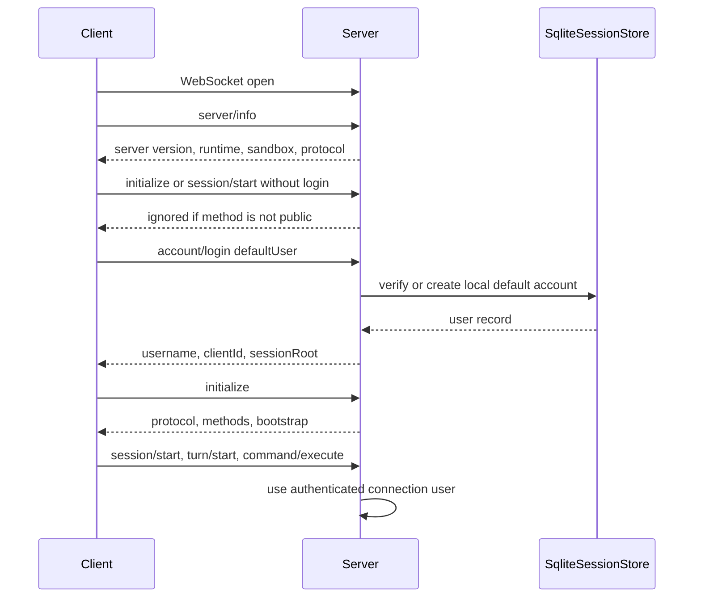

공개 method:

| Method                | 역할                                                     |
| --------------------- | -------------------------------------------------------- |
| `server/info`         | 로그인 전 CLI 표시용 server identity를 반환한다.         |
| `account/create`      | 로컬 service DB에 account를 만든다.                      |
| `account/login`       | username/password 또는 local default user로 인증한다.    |
| `account/socialLogin` | provider token을 검증하고 `provider:subject`로 매핑한다. |

그 외 method는 해당 WebSocket connection에서 login이 끝난 뒤에만 처리된다.

## 서버 API 모양

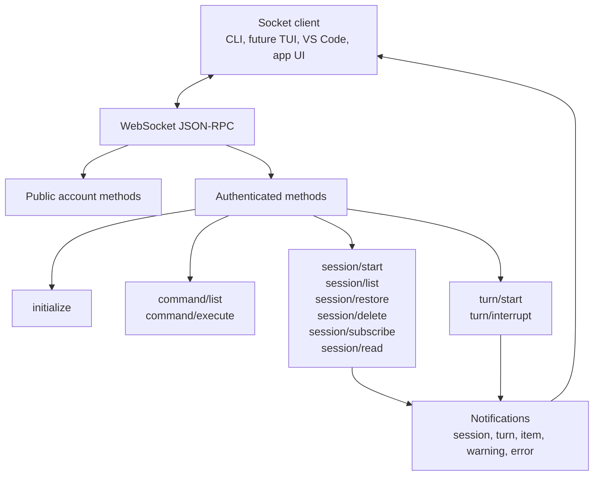

주요 request:

| Method              | 요약                                                  |
| ------------------- | ----------------------------------------------------- |
| `initialize`        | server name, protocol, methods, bootstrap report 반환 |
| `command/list`      | slash command 정의 반환                               |
| `command/execute`   | slash command 실행                                    |
| `session/start`     | 새 live session 생성                                  |
| `session/list`      | user와 `cwd` 범위의 live/persisted session 목록 반환  |
| `session/restore`   | session id 또는 workspace sequence로 복원             |
| `session/delete`    | current session이 아닌 session soft delete            |
| `session/subscribe` | session event 구독                                    |
| `session/read`      | session과 event history 읽기                          |
| `turn/start`        | user prompt 제출                                      |
| `turn/interrupt`    | 진행 중 turn 중단                                     |

## 세션 생명주기

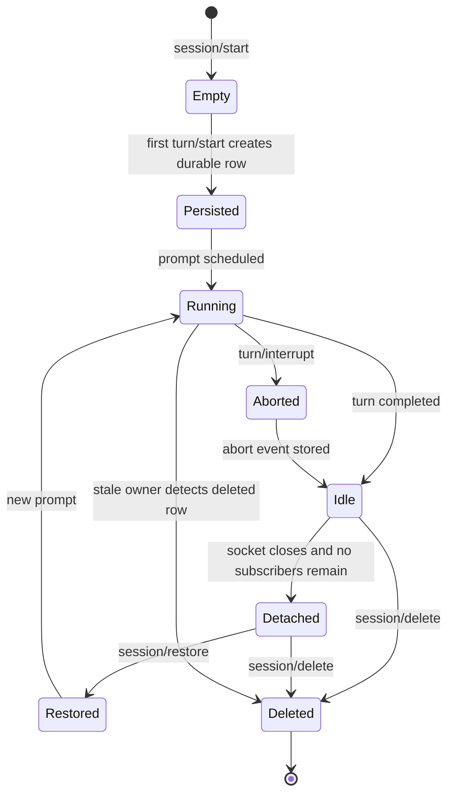

세션 규칙:

| 영역               | 계약                                                           |
| ------------------ | -------------------------------------------------------------- |
| Empty session      | persist되지 않고 workspace number가 없다.                      |
| Workspace sequence | resolved `cwd`에서 첫 user prompt 때 할당된다.                 |
| Restore selector   | full session id 또는 workspace sequence number를 받는다.       |
| Ownership          | `session_owners`에 저장되고 prompt 처리 전 claim한다.          |
| Stale output       | 다른 서버가 ownership을 가져갔으면 completion output을 버린다. |
| Delete             | soft delete 후 owner row를 지우고 stale owner를 닫게 한다.     |

## 런타임 이벤트 파이프라인

```mermaid
sequenceDiagram
  participant CLI
  participant Server as SessionServer
  participant Runtime as AgentRuntime
  participant Loop as runAgent
  participant Model as ModelClient
  participant Tools as ToolRegistry
  participant DB as SQLite

  CLI->>Server: turn/start { sessionId, prompt }
  Server->>DB: create session row if first prompt
  Server->>Runtime: submit user prompt
  Runtime-->>Server: session_configured if new runtime
  Runtime-->>Server: turn_started
  Server->>DB: append event
  Server-->>CLI: turn/started
  Runtime->>Loop: runAgent(history, config, tools)
  Loop->>Model: sample local conversation stack
  alt model returns tool calls
    Loop->>Tools: execute calls in workers
    Tools-->>Loop: function_call_output items
    Loop->>Model: sample with updated stack
  else model returns text
    Model-->>Loop: assistant text
  end
  Runtime-->>Server: agent_message, tool events, token usage
  Server->>DB: append events
  Server-->>CLI: item and usage notifications
  Runtime-->>Server: turn_complete
  Server->>DB: append terminal event
  Server-->>CLI: turn/completed
```

Runtime event와 socket notification 매핑:

| Runtime event        | Socket notification          |
| -------------------- | ---------------------------- |
| `session_configured` | `session/configured`         |
| `turn_started`       | `turn/started`               |
| `agent_message`      | `item/agentMessage`          |
| `tool_call`          | `item/toolCall`              |
| `tool_result`        | `item/toolResult`            |
| `token_count`        | `session/tokenUsage/updated` |
| `turn_complete`      | `turn/completed`             |
| `turn_aborted`       | `turn/aborted`               |
| `warning`            | `warning`                    |
| `error`              | `error`                      |

## 영속 저장 모델

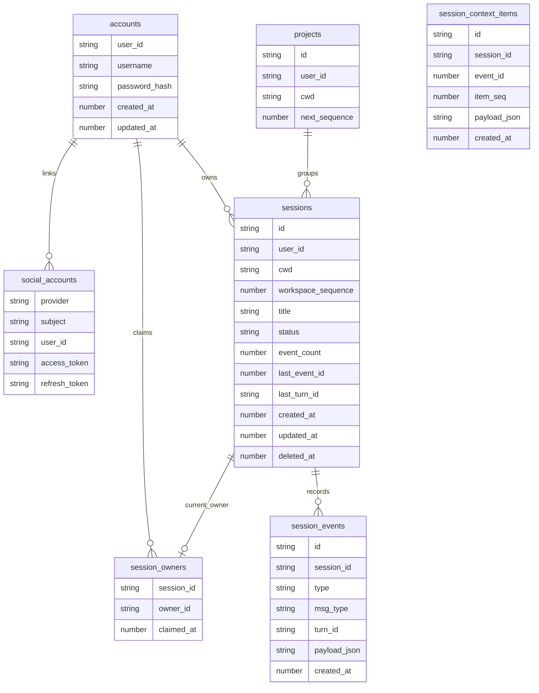

저장소는 `<dataDir>/ndx.sqlite`에 있다. 기본 data directory는
`/home/.ndx/system`이다. `dataPath`가 있으면 override하며, legacy
`sessionPath`도 같은 override로 취급한다.

## 설정과 부트스트랩

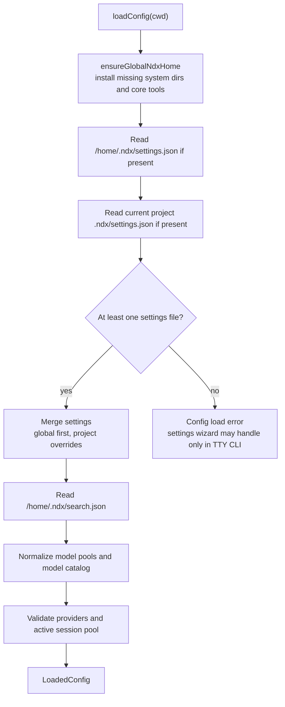

설정 load order:

1. `/home/.ndx/settings.json`
2. 현재 project `.ndx/settings.json`
3. web-search parsing rule용 `/home/.ndx/search.json`

`initialize`는 bootstrap report를 반환하고 `session/configured`도 같은 shape를
포함한다. report는 필요한 `.ndx` 요소, 절대 경로, installed/existing 상태를
기록한다.

## 모델 라우팅

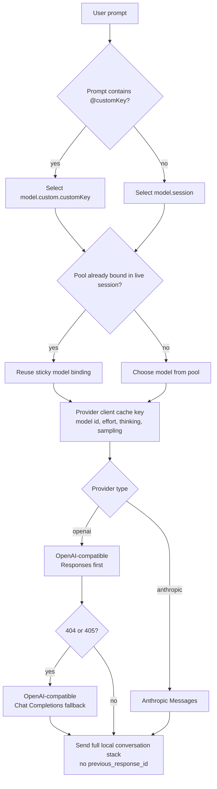

라우팅 규칙:

| 규칙                          | 효과                                                      |
| ----------------------------- | --------------------------------------------------------- |
| `model` string                | one-entry `model.session`으로 normalize된다.              |
| `model.session`               | object form에서 필수다.                                   |
| `model.custom.<key>`          | `@key`가 포함된 prompt로 선택된다.                        |
| Sticky session binding        | live session의 prefix-cache locality를 보존한다.          |
| `/model`, `/effort`, `/think` | 명시적인 provider-client binding boundary다.              |
| Responses API                 | `previous_response_id`를 보내지 않는다.                   |
| Responses fallback            | `404`, `405`는 해당 client를 Chat Completions로 전환한다. |

## 도구 발견

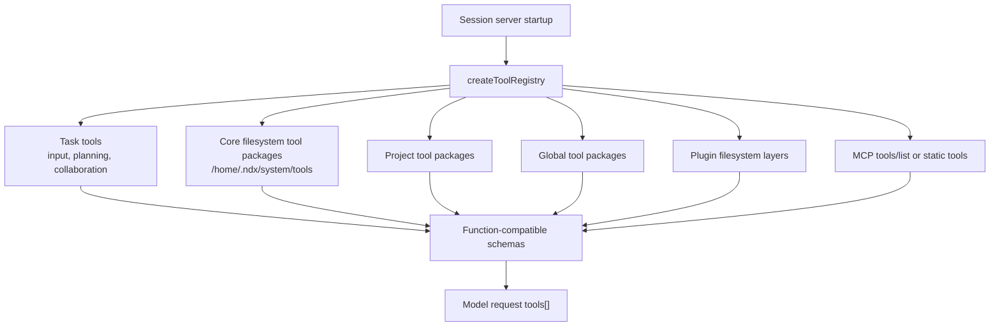

도구 layer 규칙:

| Layer         | 계약                                                     |
| ------------- | -------------------------------------------------------- |
| Task tools    | TypeScript session tool tree에 내장된다.                 |
| Core tools    | `.ndx/system/tools` 아래 external `tool.json` package다. |
| Project tools | folder name이 function name과 같은 filesystem package다. |
| Global tools  | user-level filesystem package다.                         |
| Plugin tools  | plugin filesystem layer directory에서 발견된다.          |
| MCP tools     | `tools/list`로 query하거나 static settings에서 읽는다.   |

Agent loop는 normalized function schema와 normalized tool result만 본다.
Provider-specific tool block format은 `src/agent`로 새지 않는다.

## 도구 실행

```mermaid
sequenceDiagram
  participant Model
  participant Loop as runAgent
  participant Registry as ToolRegistry
  participant Worker as Node worker process
  participant External as External tool command
  participant Docker as Docker sandbox
  participant MCP as MCP stdio server

  Model-->>Loop: tool calls
  Loop->>Registry: execute tool calls in parallel
  Registry->>Worker: spawn one worker per call
  alt task tool
    Worker->>Worker: execute TypeScript task implementation
  else external tool.json
    Worker->>External: run manifest command through runProcess
    alt shell-like and NDX_SANDBOX_CONTAINER present
      External->>Docker: docker exec -w mapped Linux sandbox path
      Docker-->>External: stdout, stderr, exit code
    else normal external command
      External-->>Worker: stdout, stderr, exit code
    end
  else MCP tool
    Worker->>MCP: JSON-RPC stdio call
    MCP-->>Worker: result
  end
  Worker-->>Registry: ToolExecutionResult
  Registry-->>Loop: function_call_output
  Loop->>Model: next sample with updated local stack
```

실행 규칙:

| 규칙                               | 효과                                                     |
| ---------------------------------- | -------------------------------------------------------- |
| model tool call당 worker 하나      | capability tool은 agent process 안에서 실행되지 않는다.  |
| 한 model response의 여러 tool call | 병렬로 실행된다.                                         |
| `runProcess`                       | spawn, stdout/stderr capture, timeout, abort를 소유한다. |
| `shellTimeoutMs`                   | manifest override가 없으면 external timeout 기본값이다.  |
| Abort                              | worker와 immediate external process로 전파된다.          |
| Deep child cleanup                 | external capability tool implementation이 소유한다.      |
| `/root` path alias                 | core path tool에서 active workspace cwd로 매핑된다.      |
| Sandbox audit log                  | `/home/.ndx/system/logs` JSONL과 Docker log에 남는다.    |

## Docker 샌드박스

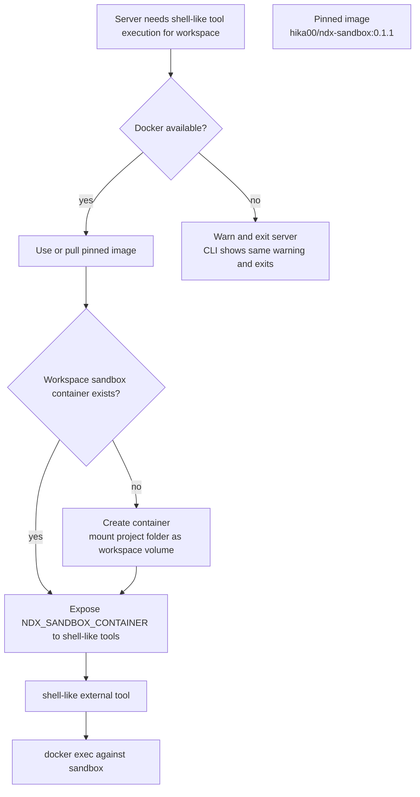

Root `docker-compose.yml`은 sandbox image를 검증하기 위한 deploy harness다.
production server owner가 아니다.

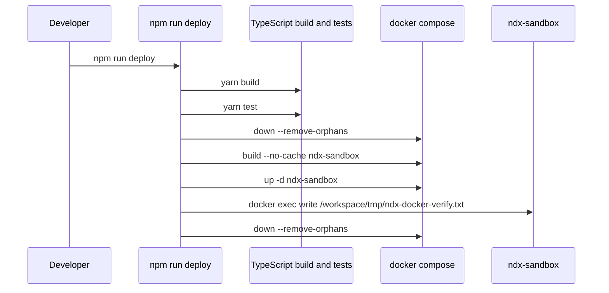

Sandbox release rule:

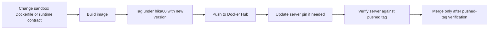

## Interrupt와 Error Flow

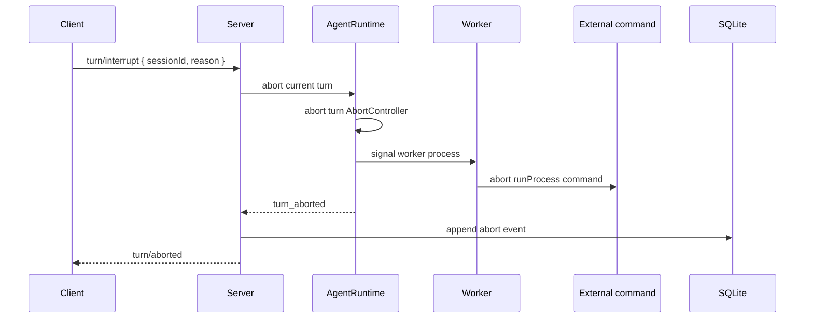

Model/runtime error는 `unauthorized`, `bad_request`, `rate_limited`,
`server_error`, `connection_failed`, `unknown`으로 분류된다. Consumer는
provider-specific error object가 아니라 normalized `error` notification을 받는다.

## Dashboard 경계

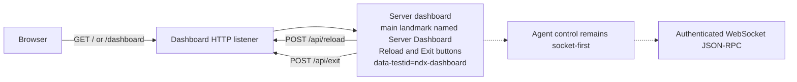

Dashboard에는 authentication/authorization이 없다. Agent interaction은 계속
socket-first다.

## 패키지와 릴리스 채널

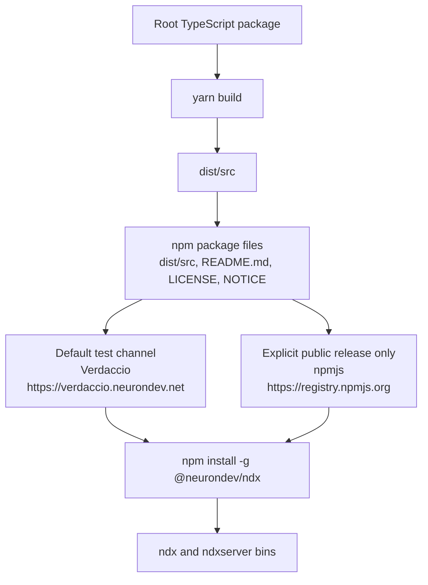

현재 published package contract:

| Field                                    | Value                                        |
| ---------------------------------------- | -------------------------------------------- |
| Package                                  | `@neurondev/ndx`                             |
| Version                                  | `0.1.13`                                     |
| Binaries                                 | `ndx`, `ndxserver`                           |
| Packed files                             | `dist/src`, `README.md`, `LICENSE`, `NOTICE` |
| Local global prefix used in verification | `/home/hika/.local`                          |

Release policy: test 가능한 빌드는 기본적으로 Verdaccio에 publish한다.
Public npm publish는 사용자가 명시적으로 요청할 때만 수행한다.

## End-To-End Turn

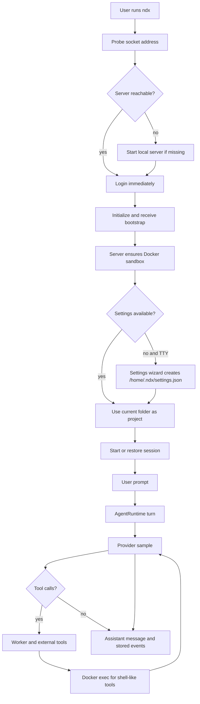

## 현재 Non-Goals

- Docker compose는 ndx server를 host하지 않는다.
- Dashboard는 아직 full UI가 아니다.
- Authenticated user scoping 이상의 authorization은 아직 구현되지 않았다.
- `model.worker`와 `model.reviewer`는 validate되지만 runtime dispatch path가
  아직 소비하지 않는다.
- Multi-agent와 agent-job task tool은 TypeScript backend가 구현되기 전까지
  unavailable이다.
- Provider-side response continuation state는 의도적으로 사용하지 않는다.
