# Complete System Architecture

This document is the single high-level architecture map for the current ndx
TypeScript runtime. It consolidates the CLI, socket server, auth, project
selection, session runtime, model routing, tool execution, Docker sandbox,
persistence, dashboard, deploy, and package distribution boundaries.

## Architecture Commitments

- `ndx` accepts one normal startup argument: an optional socket server address.
  The default address is `127.0.0.1:45123`.
- The ndx server is a local host process. Docker is not the server body.
- Docker is only a per-workspace sandbox used by shell-like capability tools.
- The server owns live sessions, event fan-out, auth, SQLite persistence,
  project listing, Docker sandbox creation, and tool execution.
- The CLI is a client of the server. It may render status and cache UI state,
  but it is not the authoritative session store.
- Non-login WebSocket JSON-RPC methods require a successful login except public
  `server/info`. The server ignores unauthenticated non-login requests.
- The server depends on a pinned sandbox image. The default image is
  `hika00/ndx-sandbox:0.1.0`.
- Sandbox image changes require a new Docker Hub tag under `hika00`, a pushed
  image, and server verification against that exact tag.
- Package distribution publishes the root package as `@neurondev/ndx`.

## Whole System

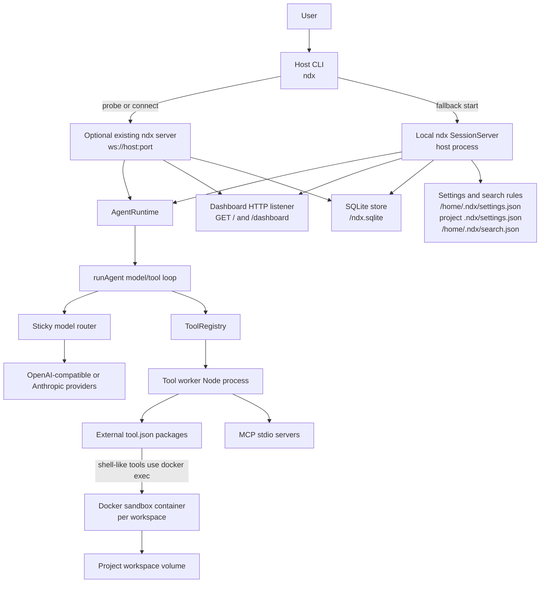

## Source Ownership

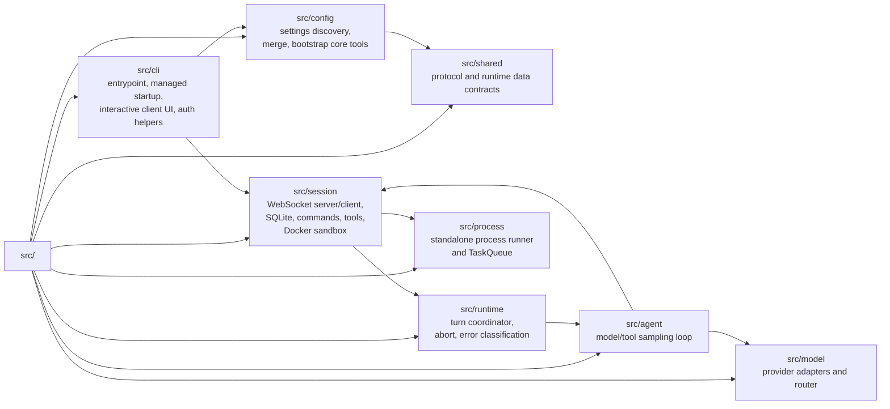

## CLI Startup

Normal `ndx` startup has one optional positional argument. Compatibility and
development paths still exist for `--mock`, `--connect`, `serve`, `ndxserver`,
and `NDX_EMBEDDED_SERVER=1`.

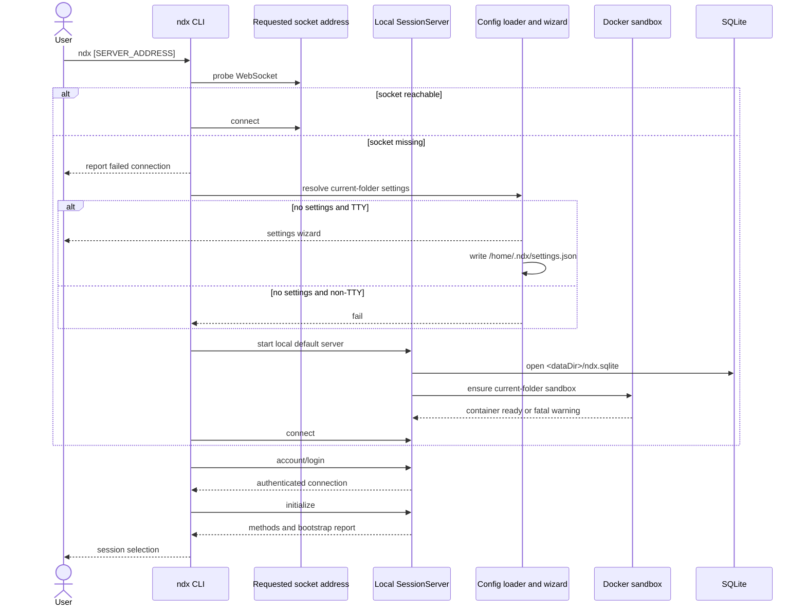

## First-Run And Session Selection

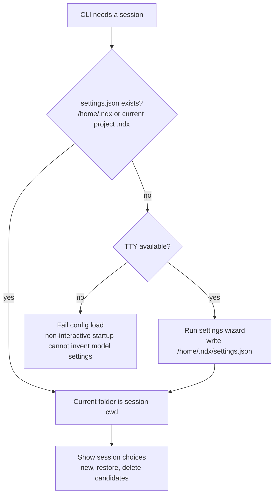

## Socket Auth Boundary

The authenticated WebSocket connection user is authoritative. User fields in
later request params are accepted for compatibility, but server-side execution
is scoped to the authenticated connection user.

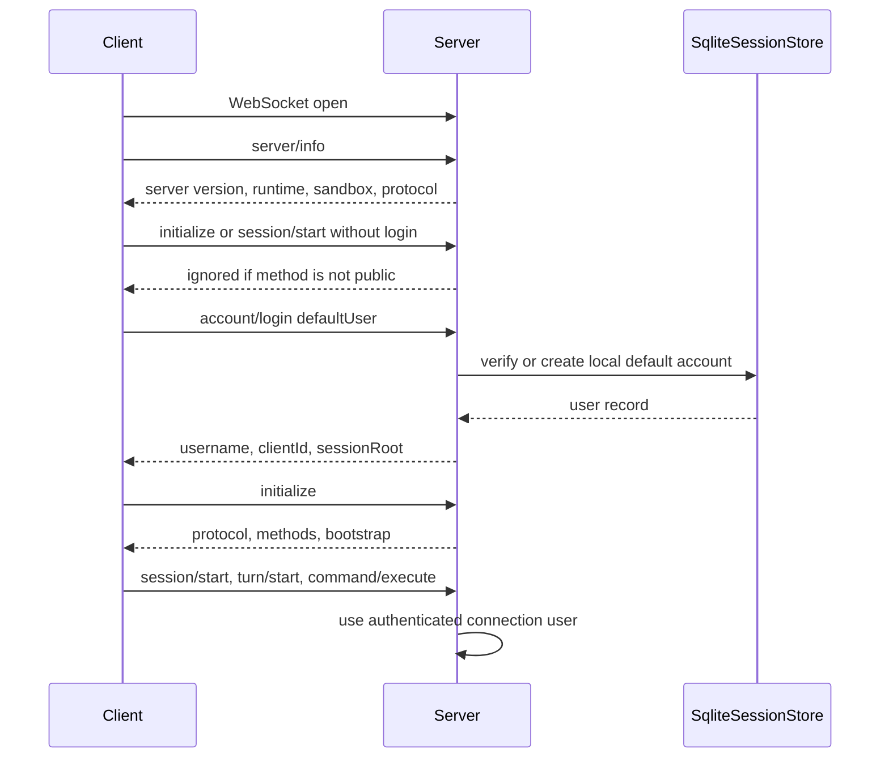

Public socket methods:

| Method                | Purpose                                                   |
| --------------------- | --------------------------------------------------------- |
| `server/info`         | Return server identity for pre-login CLI display.         |
| `account/create`      | Create an account in the local service database.          |
| `account/login`       | Authenticate username and password or local default user. |
| `account/socialLogin` | Validate provider token and map `provider:subject`.       |

All other socket methods require login on that WebSocket connection.

## Server API Shape

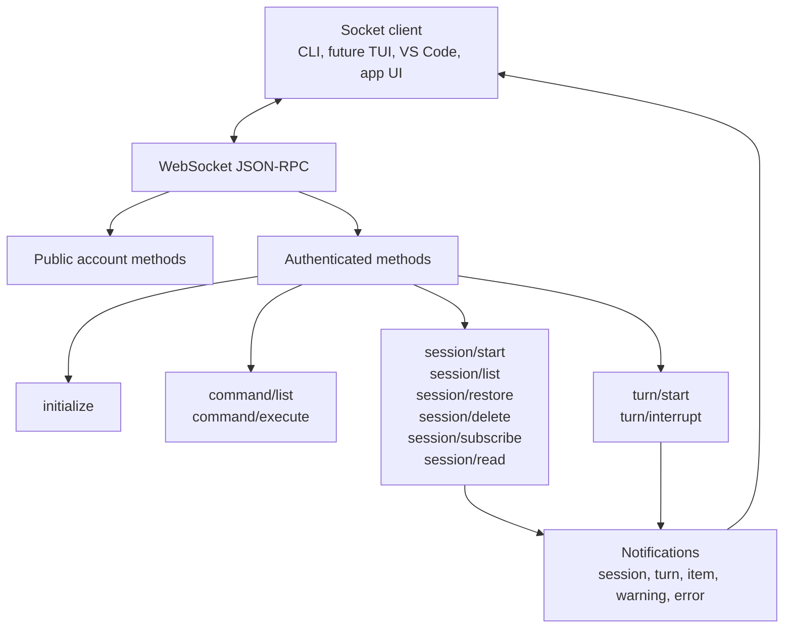

## Session Lifecycle

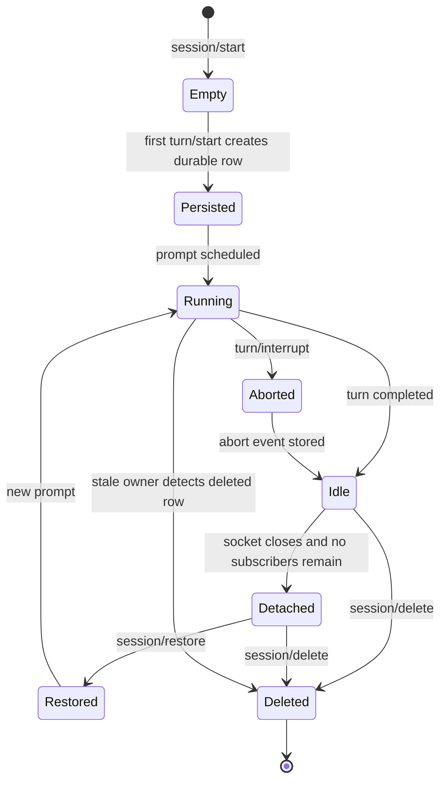

Session rules:

| Area               | Contract                                                              |
| ------------------ | --------------------------------------------------------------------- |
| Empty sessions     | Not persisted and have no workspace number.                           |
| Workspace sequence | Assigned on the first user prompt for the resolved `cwd`.             |
| Restore selector   | Accepts the full session id or workspace sequence number.             |
| Ownership          | Stored in `session_owners`; prompt handling claims ownership.         |
| Stale output       | Discarded when another server owns the session before completion.     |
| Delete             | Soft deletes session, clears owner, and forces stale owners to close. |

## Runtime Event Pipeline

```mermaid
sequenceDiagram
  participant CLI
  participant Server as SessionServer
  participant Runtime as AgentRuntime
  participant Loop as runAgent
  participant Model as ModelClient
  participant Tools as ToolRegistry
  participant DB as SQLite

  CLI->>Server: turn/start { sessionId, prompt }
  Server->>DB: create session row if first prompt
  Server->>Runtime: submit user prompt
  Runtime-->>Server: session_configured if new runtime
  Runtime-->>Server: turn_started
  Server->>DB: append event
  Server-->>CLI: turn/started
  Runtime->>Loop: runAgent(history, config, tools)
  Loop->>Model: sample local conversation stack
  alt model returns tool calls
    Loop->>Tools: execute calls in workers
    Tools-->>Loop: function_call_output items
    Loop->>Model: sample with updated stack
  else model returns text
    Model-->>Loop: assistant text
  end
  Runtime-->>Server: agent_message, tool events, token usage
  Server->>DB: append events
  Server-->>CLI: item and usage notifications
  Runtime-->>Server: turn_complete
  Server->>DB: append terminal event
  Server-->>CLI: turn/completed
```

Runtime notification mapping:

| Runtime event        | Socket notification          |
| -------------------- | ---------------------------- |
| `session_configured` | `session/configured`         |
| `turn_started`       | `turn/started`               |
| `agent_message`      | `item/agentMessage`          |
| `tool_call`          | `item/toolCall`              |
| `tool_result`        | `item/toolResult`            |
| `token_count`        | `session/tokenUsage/updated` |
| `turn_complete`      | `turn/completed`             |
| `turn_aborted`       | `turn/aborted`               |
| `warning`            | `warning`                    |
| `error`              | `error`                      |

## Persistence Model

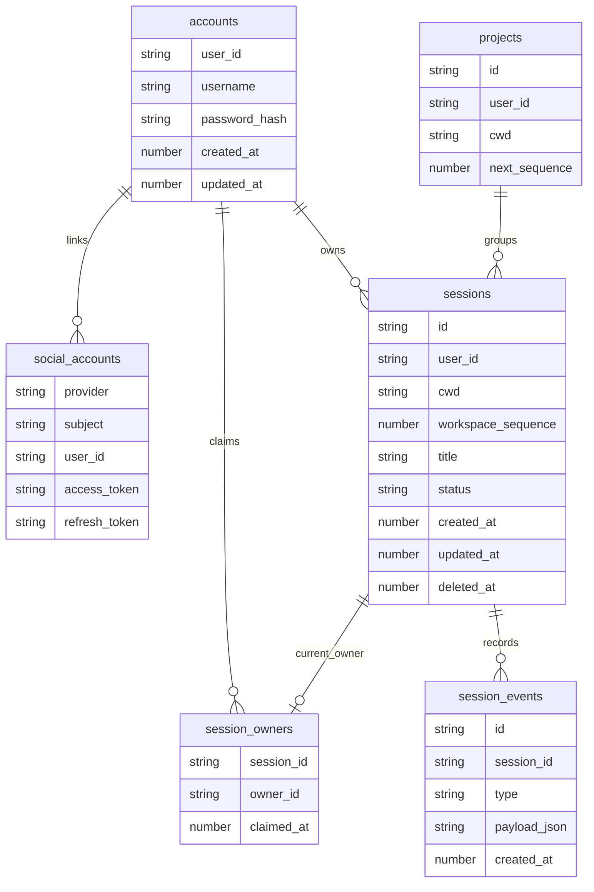

The store lives at `<dataDir>/ndx.sqlite`. The default data directory is
`/home/.ndx/system`. `dataPath` overrides it; legacy `sessionPath` is accepted
as the same override.

## Config And Bootstrap

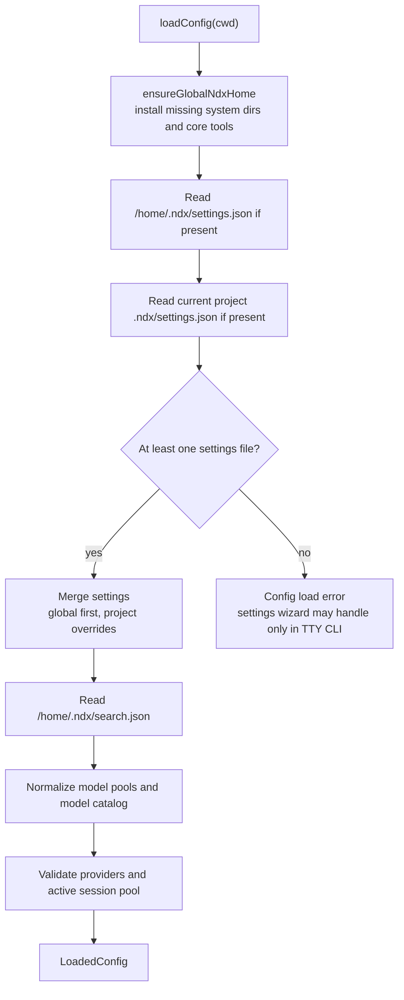

Settings load order:

1. `/home/.ndx/settings.json`
2. Current project `.ndx/settings.json`
3. `/home/.ndx/search.json` for web-search parsing rules

The bootstrap report is returned by `initialize` and included in
`session/configured`. It records required `.ndx` elements, absolute paths, and
whether each element was installed or already existed.

## Model Routing

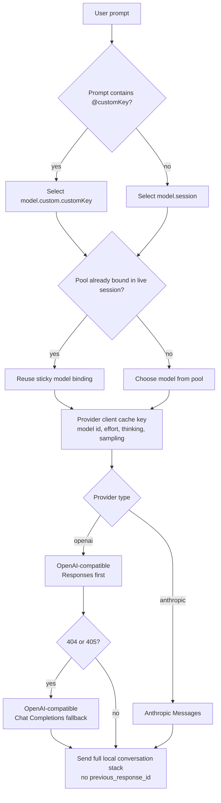

Routing rules:

| Rule                          | Effect                                                  |
| ----------------------------- | ------------------------------------------------------- |
| `model` string                | Normalized to one-entry `model.session`.                |
| `model.session`               | Required for object form.                               |
| `model.custom.<key>`          | Selected by prompts containing `@key`.                  |
| Sticky session binding        | Keeps prefix-cache locality for a live session.         |
| `/model`, `/effort`, `/think` | Explicit provider-client binding boundaries.            |
| Responses API                 | Does not send `previous_response_id`.                   |
| Responses fallback            | `404` and `405` switch that client to Chat Completions. |

## Tool Discovery

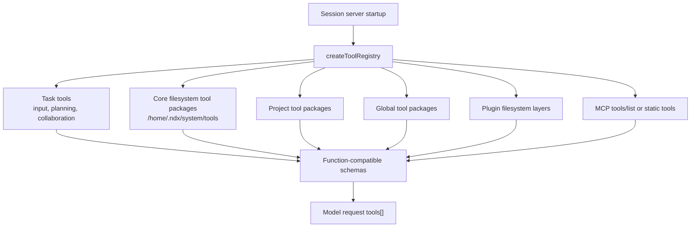

Tool layer rules:

| Layer         | Contract                                                           |
| ------------- | ------------------------------------------------------------------ |
| Task tools    | Built into TypeScript session tool tree.                           |
| Core tools    | External `tool.json` packages installed under `.ndx/system/tools`. |
| Project tools | Filesystem packages with folder name equal to function name.       |
| Global tools  | User-level filesystem packages.                                    |
| Plugin tools  | Discovered from plugin filesystem layer directories.               |
| MCP tools     | Queried with `tools/list` or loaded from static settings.          |

The agent loop only sees normalized function schemas and normalized tool
results. Provider-specific tool block formats do not leak into `src/agent`.

## Tool Execution

```mermaid
sequenceDiagram
  participant Model
  participant Loop as runAgent
  participant Registry as ToolRegistry
  participant Worker as Node worker process
  participant External as External tool command
  participant Docker as Docker sandbox
  participant MCP as MCP stdio server

  Model-->>Loop: tool calls
  Loop->>Registry: execute tool calls in parallel
  Registry->>Worker: spawn one worker per call
  alt task tool
    Worker->>Worker: execute TypeScript task implementation
  else external tool.json
    Worker->>External: run manifest command through runProcess
    alt shell-like and NDX_SANDBOX_CONTAINER present
      External->>Docker: docker exec -w mapped Linux sandbox path
      Docker-->>External: stdout, stderr, exit code
    else normal external command
      External-->>Worker: stdout, stderr, exit code
    end
  else MCP tool
    Worker->>MCP: JSON-RPC stdio call
    MCP-->>Worker: result
  end
  Worker-->>Registry: ToolExecutionResult
  Registry-->>Loop: function_call_output
  Loop->>Model: next sample with updated local stack
```

Execution rules:

| Rule                           | Effect                                                 |
| ------------------------------ | ------------------------------------------------------ |
| One worker per model tool call | Capability tools do not execute in the agent process.  |
| Parallel model tool calls      | Launched in parallel for one model response.           |
| `runProcess`                   | Owns spawn, stdout/stderr capture, timeout, and abort. |
| `shellTimeoutMs`               | Default external timeout unless manifest overrides it. |
| Abort                          | Propagates to worker and immediate external process.   |
| Deep child cleanup             | Owned by the external capability tool implementation.  |

## Docker Sandbox

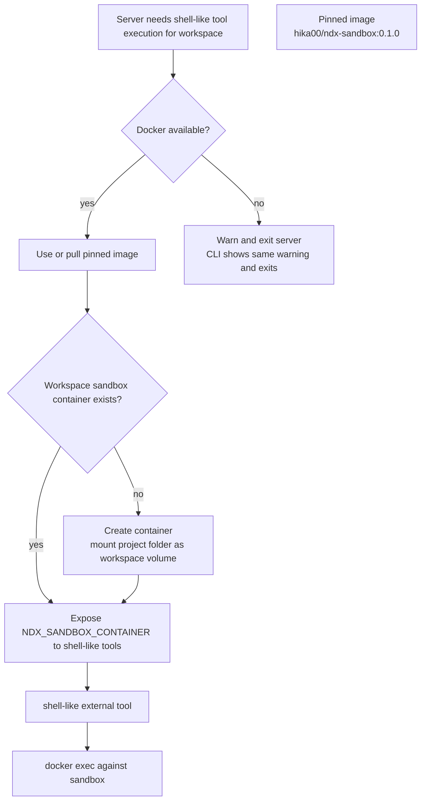

The root `docker-compose.yml` is a deploy verification harness for the sandbox
image. It is not the production server owner.

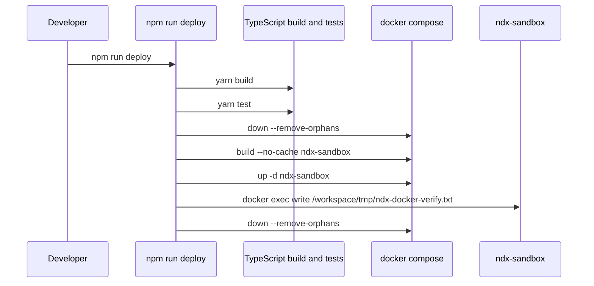

Sandbox release rule:

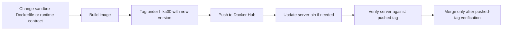

## Interrupt And Error Flow

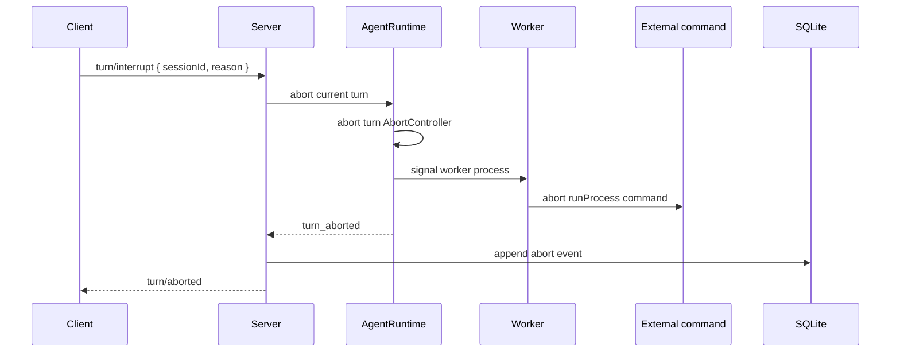

Model and runtime errors are classified as `unauthorized`, `bad_request`,
`rate_limited`, `server_error`, `connection_failed`, or `unknown`. Consumers
receive normalized `error` notifications rather than provider-specific error
objects.

## Dashboard Boundary

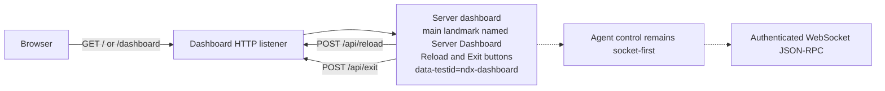

The dashboard has no authentication or authorization. Agent interaction remains
socket-first.

## Package And Release Channels

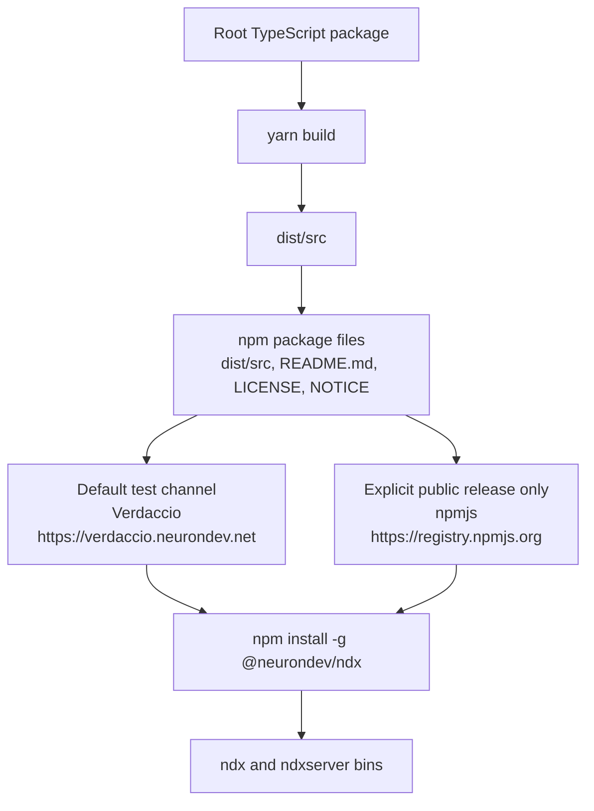

Current published package contract:

| Field                                    | Value                                        |
| ---------------------------------------- | -------------------------------------------- |
| Package                                  | `@neurondev/ndx`                             |
| Version                                  | `0.1.10`                                     |
| Binaries                                 | `ndx`, `ndxserver`                           |
| Packed files                             | `dist/src`, `README.md`, `LICENSE`, `NOTICE` |
| Local global prefix used in verification | `/home/hika/.local`                          |

Release policy: publish testable builds to Verdaccio by default. Publish to
public npm only when explicitly requested.

## End-To-End Turn

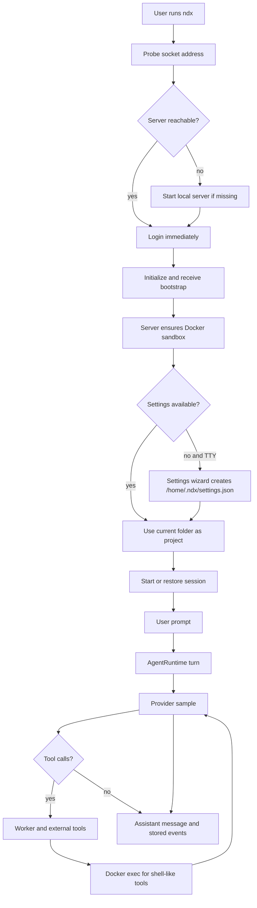

## Current Non-Goals

- Docker compose does not host the ndx server.
- The dashboard is not a full UI yet.
- Authorization beyond authenticated user scoping is not implemented yet.
- `model.worker` and `model.reviewer` are validated but not consumed by runtime
  dispatch yet.
- Multi-agent and agent-job task tools remain unavailable until their
  TypeScript backends are implemented.
- Provider-side response continuation state is intentionally unused.
